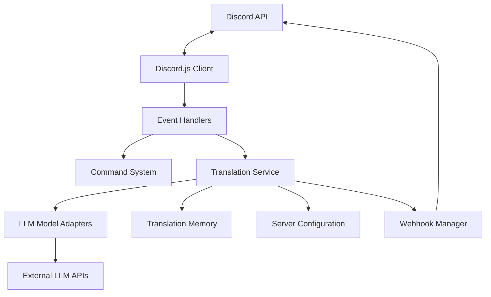

# Discord Translation Bot - System Patterns

## System Architecture

The Discord Translation Bot follows a modular event-driven architecture with clearly separated concerns. Here's the high-level structure:

## Core Components

### 1. Discord.js Client (`src/index.js`)
- Entry point for the application
- Initializes Discord client with required intents and permissions
- Manages command and event registration
- Maintains active session tracking via `client.activeSessions` Map

### 2. Command System (`src/commands/`)
- Handles Discord command interactions
- Individual command modules for each function (start, end, mode, model, etc.)
- Commands load dynamically from files in commands directory

### 3. Event Handlers (`src/events/`)
- Process Discord events (messageCreate, ready)
- Main message processing in `messageCreate.js`
- Translation request queueing and management

### 4. Translation Service (`src/services/translationService.js`)
- Central translation coordination
- Language detection and translation workflow
- Message preprocessing
- Performance metrics tracking

### 5. Model Adapters (`src/models/`)
- Adapters for each LLM provider (OpenAI, Anthropic, Google)
- Normalize different API formats to consistent interface
- Handle provider-specific error handling

### 6. Server Configuration (`src/utils/serverConfig.js`)
- Per-server configuration persistence
- Default settings management
- Stats tracking and updates

### 7. Translation Memory (`src/utils/translationMemory.js`)
- Caching system for previously translated messages
- Optimized write buffer to reduce disk I/O
- Memory-efficient storage with Map data structure

### 8. Webhook Manager (`src/utils/webhookManager.js`)
- Fast webhook-based responses
- Message splitting for long content
- Fallback mechanisms for webhook failures

## Key Design Patterns

### 1. Event-Driven Architecture
The bot is built around Discord.js events, using a publisher-subscriber pattern for handling Discord events and commands.

### 2. Module Pattern
Each file exports specific functionality, promoting encapsulation and separation of concerns.

### 3. Adapter Pattern
Model adapters provide a unified interface to different LLM services, abstracting away their implementation differences.

### 4. Command Pattern
Discord commands are implemented as separate modules with a consistent interface (name and execute method).

### 5. Queue System
Translation requests use a queue system with concurrency control for better performance under load.

### 6. Repository Pattern
Configuration and translation memory implement a repository pattern for data persistence.

### 7. Caching Strategy
Multi-level caching with in-memory cache and persistent storage for translation memory.

### 8. Factory Pattern
Language detection and translation functions act as factories, producing results based on inputs and configuration.

## Data Flow

### Translation Process
1. Message received → Discord.js client → messageCreate event
2. Check for active session
3. Add to translation queue if session active
4. Check translation memory for cached result
5. If not cached:
   - Detect language
   - Apply relevant translation based on mode
   - Update translation memory
6. Format and send response (via webhook when possible)
7. Update statistics

### Server Configuration
- Stored as JSON files per server ID
- Includes mode, model preferences, and usage statistics
- Loaded on demand with default fallbacks

### Translation Memory
- Uses a Map structure for in-memory storage
- Batched disk writes to improve performance
- Periodic pruning to limit size

## Technical Decisions

### 1. LLM Provider Flexibility
Support for multiple LLM providers allows for:
- Fallback options if one service fails
- User choice based on quality preferences
- Cost optimization strategies

### 2. Session-Based Translation
Translation only occurs in channels with an active session to:
- Reduce API costs
- Prevent unwanted translations
- Allow channel-specific configuration

### 3. Webhook Response System
Using Discord webhooks for responses:
- Significantly faster than standard replies
- Support for custom avatars and usernames
- Better handling of rate limits

### 4. Language Detection Approach
Using LLM for language detection instead of traditional detection libraries:
- More accurate for mixed language content
- Better handling of short messages and chat language
- Consistent results across languages

### 5. Translation Memory
Implementing a translation memory system:
- Reduces API costs for repeated phrases
- Improves response time
- Maintains consistent translations
